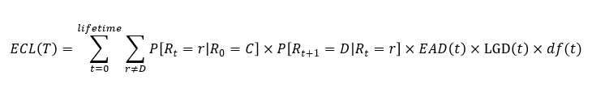

.. image:: https://img.shields.io/badge/-PyScaffold-005CA0?logo=pyscaffold
    :alt: Project generated with PyScaffold
    :target: https://pyscaffold.org/

=======
Z-model
=======

   A simple IFRS9 and Stress Testing Credit Risk Model.

The expected credit loss (ECL) is calculated using a marginal loss framework as follows:

The transition probabilities in the above formula are calculated using the
`Z risk engine <https://www.z-riskengine.com/media/1032/a-one-parameter-representation-of-credit-risk-and-transition-matrices.pdf>`_
framework. The model allows for both single default definition and multiple default definition probabilities to be
calculated by configuring the TtC Transition Matrix, in the assumptions file, to allow for the probability of
transitioning back to a performing state.

The loss given default can be calculated in various different methods to allow for secured and unsecured portfolios. The
secured LGDs are made FiT by a collateral index adjustment. Unsecured LGDs are assumed to be constant throughout
the economic cycle.

The exposure at default can be calculated in various ways, e.g. amortising, constant or using one of the credit
conversion factor methods to cater of different product characteristics.

Getting Started
***************

Requirements:
#############

1. Install `Git <https://git-scm.com/download/win>`_
   During setup ensure the following options are selected:

   * **Select Components**: ensure "Windows Explorer integration" is selected.
   * **Choosing the SSH executable**: select "Use OpenSSH".  This option may not be displayed.
   * **Configuring the line endings conventions**: select "Checkout as-is, commit Unix-style line endings".

2. Install `Python <https://www.python.org/downloads/windows/>`_

How to install the Z-model package:
###################################

1. Open Git Bash (Right click in a folder and select :code:`Git Bash Here`)
2. Create working directory :code:`mkdir Z-model`
3. Change directory into Z-model :code:`cd Z-model`
4. Inside the directory create a virtual environment to store all your packages :code:`py -m venv .venv`
5. Activate the virtual environment :code:`source .venv/Scripts/activate`
6. Upgrade pip and setuptools :code:`py -m pip install --upgrade pip`
7. Install Z-model's dependencies:
   :code:`pip install --trusted-host raw.githubusercontent.com -r https://raw.githubusercontent.com/gbisschoff/Z-model/main/requirements.txt`
8. Install the Z-model :code:`pip install git+https://github.com/gbisschoff/Z-model.git`

How to run the Z-model:
#######################

Once the Z-model is installed, the CLI can be used to produce ECL results.
It is important to ensure the inputs are correctly configured. You can find templates with dummy inputs in
the `data <./data>`_ directory.

1. Open your favourite CLI, e.g. Git Bash, in the Z-model directory.
2. Ensure the virtual environment in which the Z-model was installed is activated.
   This can be done using :code:`source .venv/Scripts/activate` in Git Bash.
3. execute :code:`z_model run --help` to get help on how to use the Z-model CLI.

FAQ
***
TODO: Update section with common questions and answers
